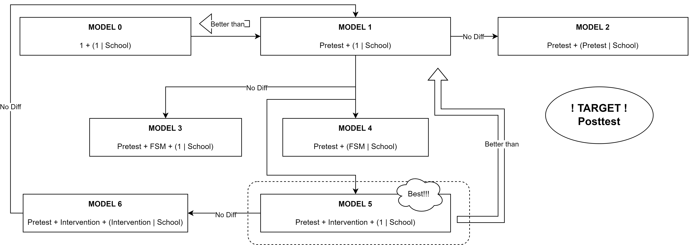

```{r setup, include=FALSE}
knitr::opts_chunk$set(echo = TRUE)
```

------------------------------------------------------------------------

# Part 1: Introduction

## **1.1 Overview of Randomized and Cluster Randomized Trials**

Randomized Controlled Trials (RCTs) are the gold standard for evaluating intervention effectiveness, minimizing bias by randomly assigning participants to intervention or control groups. Cluster Randomized Trials (CRTs), a subset of RCTs, randomize groups or 'clusters' (like schools or communities) instead of individuals, making them ideal for educational research where interventions are applied at group levels. This methodology addresses data's inherent groupings, ensuring a more accurate assessment of interventions.

## 1.2 Intro to the Dataset

### 1.2.1 Prepare for the Runtime and Dataset

*gridExtra is a good library for combining multiple ggplots graphs in one graph, while par() can't make it.*

```{r warning=FALSE,message=FALSE}
# --------------------------------------------------------
## clear the environment var area
# rm(list = ls())
## clear all plots
# graphics.off()
## clear the console area
# cat("\014")
# --------------------------------------------------------
# install.packages("gridExtra")
# --------------------------------------------------------
require(lme4)
require(lmerTest)
require(ggplot2)
require(sjPlot)
require(gridExtra)
```

Download data set from GitHub and show the first lines.

```{r}
CRT <-
  read.csv("https://andygolightly.github.io/teaching/MATH43515/CRT.csv",
           header = TRUE)
head(CRT)
# dim(CRT)
```

### 1.2.2 **Dataset Overview**

For our analysis, we have access to a dataset comprising data collected from a cluster randomized trial in an educational setting. The dataset includes the following variables:

-   **Pupil**: Anonymized student ID, ensuring the confidentiality of participants' identities.

-   **School**: Anonymized school ID, ranging from 1 to 20, representing the different clusters within the study.

-   **Class**: Anonymized class ID within schools, categorized into two groups (1 or 2), indicating the specific class units.

-   **Intervention**: An indicator of whether a pupil was in the treatment group (1) receiving the educational intervention or in the control group (0) not receiving the intervention.

-   **FSM**: An indicator of pupil eligibility for free school meals (1 = eligible, 0 = not eligible), serving as a proxy for socio-economic status.

-   **Pretest**: Scores from a pre-test administered to all pupils before the intervention, providing a baseline measure of their knowledge or skills.

-   **Posttest**: Scores from a post-test administered after the intervention, serving as the response variable to assess the impact of the educational intervention on pupil outcomes.

## 1.3 Exploratory Data Analysis

### 1.3.1 Single Variables Descriptive Statistics

```{r}
summary(CRT)
```

```{r}
# --------------------------------------------------------
bar.Posttest = ggplot(data = CRT, aes(Posttest)) +
  geom_bar()
bar.Pretest = ggplot(data = CRT, aes(Pretest)) +
  geom_bar()
bar.Intervention = ggplot(data = CRT, aes(Intervention)) +
  geom_bar()
bar.School = ggplot(data = CRT, aes(School)) +
  geom_bar()
bar.FSM = ggplot(data = CRT, aes(FSM)) +
  geom_bar()
bar.class = ggplot(data = CRT, aes(class)) +
  geom_bar()
# --------------------------------------------------------
# boxplot
boxplot.Posttest = ggplot(data = CRT, aes(Posttest)) +
  geom_boxplot(outlier.colour = "red", outlier.shape = 1)
boxplot.Pretest = ggplot(data = CRT, aes(Pretest)) +
  geom_boxplot(outlier.colour = "red", outlier.shape = 1)
# --------------------------------------------------------
# put these bar charts together
grid.arrange(bar.Posttest,
             bar.Pretest,
             bar.Intervention,
             bar.School,
             bar.FSM,
             bar.class,
             ncol = 3)
grid.arrange(boxplot.Posttest,
             boxplot.Pretest,
             ncol = 2)
# --------------------------------------------------------
# remove the plot cache memory
remove(bar.Posttest)
remove(bar.Pretest)
remove(bar.Intervention)
remove(bar.School)
remove(bar.FSM)
remove(bar.class)
remove(boxplot.Posttest)
remove(boxplot.Pretest)
```

### 1.3.2 Correlation between variables

```{r message=FALSE}
# Correlation between two varibales with GGpairs
library("GGally")
ggpairs(CRT)+theme_bw()
```

# Part 2: Methods

## 2.1 **Multilevel Models in RCTs Overview**

Multilevel models, also known as hierarchical linear models or mixed-effects models, are essential for analyzing RCT data with nested structures, such as participants within classrooms or schools. These models address the independence assumption violation by accounting for data hierarchy, making them ideal for cluster RCTs where interventions target groups, leading to intra-cluster correlations.

## 2.2 **Application to a 3-Level Cluster Randomized Trial**

The educational intervention dataset under study is an example of a 3-level cluster randomized trial, where pupils (level 1) are nested within classes (level 2), which in turn are nested within schools (level 3). Multilevel modeling is particularly apt for this dataset as it allows us to account for the variability at each of these levels, providing more accurate estimates of the intervention effects and associated uncertainties.


## **2.3 Variance Decomposition and ICC**

In multilevel modeling, variance decomposition and the Intra-Class Correlation Coefficient (ICC) are central concepts. Variance decomposition breaks down the total variance in the outcome into components associated with each hierarchical level. The ICC, calculated from this decomposition, indicates the variance proportion due to clustering at higher levels. High ICC values highlight the importance of multilevel modeling. Testing for significant variance components involves likelihood ratio tests to compare models with and against random effects at each level, guiding the inclusion of relevant variance components.

$$
VPC = \frac{\sigma^2_{between}}{\sigma^2_{between} + \sigma^2_{within}}
$$

where $\sigma^2_{between}$ is the variance between clusters (e.g., schools), and $\sigma^2_{within}$ is the variance within clusters (e.g., individual students).

$$
ICC = \frac{\sigma^2_{between}}{\sigma^2_{between} + \sigma^2_{within}}
$$

## 2.4 **Methodological Approach**

In multilevel modeling, assessing variance components' significance across levels is crucial, often achieved through likelihood ratio tests comparing models with varying random effects. Initially, a null model estimates ICC by partitioning variance, followed by models incorporating fixed effects (like intervention and pre-test scores) and random intercepts (for classes and schools). Model efficacy is then evaluated using likelihood ratio tests alongside AIC/BIC criteria, ensuring the inclusion of meaningful variance components and optimizing model fit.

# Part 3: Analysis

In this section, we conduct a detailed analysis using multilevel modeling to understand the effects of the educational intervention. We fit several models to our data, compare them using appropriate diagnostic tools, and address key research questions.



## 3.1 Empty Model

### 3.1.1 Original **Model Fitting (2 or 3 levels?)**

We start by fitting a basic multilevel model without the intervention variable to establish a baseline. This model includes random intercepts for schools and classes to account for the hierarchical structure of our data.

```{r}
# empty model / intercept-only mode
Model.0.2level = lmer(Posttest ~ 1 + (1 | School),
                  data = CRT)
Model.0.3level = lmer(Posttest ~ 1 + (1 | School)
                  + (1 | School:class),
                  data = CRT)
ranova(Model.0.2level)
ranova(Model.0.3level)
# Model.0.2level is better
Model.0 = Model.0.2level
```

### 3.1.2 **Intra-Class Correlations (ICCs) and Variance Partition Coefficients**

We calculate the ICCs to quantify how much of the total variance in post-test scores is attributable to differences between schools and classes. The VPCs further help us understand the proportion of variance explained by each level of the hierarchy. (Finally we can say only School-Pupil is better)

```{r}
# require(performance)
## https://easystats.github.io/performance/reference/icc.html
# icc(Model.0)
# icc(Model.1)
# icc(Model.5)
Model.0.REsummary <- as.data.frame(VarCorr(Model.0.3level))
Model.0.REsummary
sig <- Model.0.REsummary$vcov[3]  #Residual variance
sigv <- Model.0.REsummary$vcov[2] #RE variance for school
sigu <- Model.0.REsummary$vcov[1] #RE variance for class
totalvar <- sum(Model.0.REsummary$vcov) #total variance
vpc.school <- sigv / totalvar
vpc.class <- sigu / totalvar
cat('The VPC of School is: ', vpc.school, '\n')
cat('The VPC of class is: ', vpc.class, '\n')
# --------------------------------------------------------
icc.school <- sigv / totalvar
icc.class <- (sigu + sigv) / totalvar
cat('The ICC of School is: ', icc.school, '\n')
cat('The ICC of class is: ', icc.class, '\n')
```

## 3.2 **Effect of Pre-test Scores**

To understand the impact of baseline knowledge, we add the pre-test scores to our model and observe how the intervention effect changes. (Add Pretest to the Empty Model can significantly reduce `AIC`, `BIC`. And the `Pr(>Chisq)` is quite low that can reject the Null Hypothesis.

```{r}
# summary(Model.0)
# --------------------------------------------------------
# REsummary <- as.data.frame(VarCorr(Model.0))
# REsummary
# summary(Model.0)$varcor
# --------------------------------------------------------
Model.1 = lmer(Posttest ~ Pretest + (1 | School),
               data = CRT)
# summary(Model.1)
# --------------------------------------------------------
ranova(Model.1)
anova(Model.1, Model.0)
# Model 1 is better than Model 0
```

But the random effects of Pretest in School level seems not good. We can't add it to the Random effects.

```{r}
# Model 2 is not better than model 1
Model.2 = lmer(Posttest ~ Pretest + (Pretest | School),
               data = CRT)
ranova(Model.2)
anova(Model.2, Model.1)
```

## 3.3 **Role of FSM**

Next, we explore the role of free school meal eligibility (FSM) by including it in our model. This helps us understand if socio-economic status influences the intervention effect.

```{r}
# Model 3 (add FSM to Fix Effects) is not better than Model 1
Model.3 = lmer(Posttest ~ Pretest + FSM + (1 | School),
               data = CRT)
ranova(Model.3)
anova(Model.3, Model.1)
```

```{r}
# Model 4 (add FSM to Random Effects) is not better than Model 1
Model.4 = lmer(Posttest ~ Pretest + (FSM | School),
               data = CRT)
ranova(Model.4)
anova(Model.4, Model.1)
```

From the output of `Model.3` and `Model.4`, when we add FSM to the fixed / random effects, neither of them can improve the model performance. Both of their `Pr(>Chisq)` are bigger than 0.05.

## 3.4 **Intervention Effect**

Finally, we introduce the intervention variable to assess its effect. We fit a model including the intervention and inspect the coefficient and confidence interval for significance.

```{r}
Model.5 = lmer(Posttest ~ Pretest + Intervention + (1 | School),
               data = CRT)
ranova(Model.5)
anova(Model.5, Model.1)
```

Adding Intervention to random effects cannot reject the zero hypothesis, so it is not appropriate.

```{r}
Model.6 = lmer(Posttest ~ Pretest + Intervention + (Intervention | School),
               data = CRT)
ranova(Model.6)
anova(Model.6, Model.5)
```

# Part 4: Discussion of results

So far the best model is Model.5, which mathematical form is:

$$
Y_{ijk} = \beta_0 + \beta_1 \text{Pretest}_{ijk} + \beta_2 \text{Intervention}_{ijk} + u_{j} + \varepsilon_{ijk}
$$ Where:

-   $Y_{ijk}$ is the post-test score for the $i$-th pupil in the $j$-th school.
-   $\beta_0$ is the intercept, representing the expected post-test score for a pupil with a pre-test score of 0 in the control group.
-   $\beta_1$ is the coefficient for the pre-test scores, indicating the expected change in post-test score for each one-unit increase in the pre-test score, holding all other variables constant.
-   $\beta_2$ is the coefficient for the intervention, representing the expected difference in post-test scores between the treatment and control groups, controlling for pre-test scores.
-   $u_{j}$ is the random effect for the $j$-th school, capturing the variation in post-test scores across schools that is not explained by the pre-test scores or intervention status.
-   $\varepsilon_{ijk}$ is the residual error term for the $i$-th pupil in the $j$-th school, capturing the individual-level variation in post-test scores not explained by the model.

In this model, the fixed effects are the intercept, pre-test scores, and intervention status, while the random effect is the variation at the school level, indicated by $u_{j}$. The model assumes normal distributions for both the random effects and the residual errors.

$$
u_j \sim N(0,\sigma)
$$

## 4.1 Model Summary

```{r}
summary(Model.5)
```

## 4.2 Model Diagnostics and Visualization

### 4.2.1 Plot the Residuals

```{r}
plot(Model.5)
```

### 4.2.2 Q-Q plot of Residuals

```{r}
qqnorm(resid(Model.5))
qqline(resid(Model.5))
```

### 4.2.3 Q-Q plot of Random Effects

```{r}
# We only have one random effect
# It is the intercept of School level
qqnorm(ranef(Model.5)[[1]][,1])
qqline(ranef(Model.5)[[1]][,1])
```

From `Part 4.2.3` and `Part 4.2.4` we can say the random effects obey the Normal Distribution assumption and the Model fits well.

```{r}
CRT$Posttest.pred = predict(Model.5)
ggplot(CRT,
       aes(
         x = Pretest,
         y = Posttest,
         col = School,
         group = School
       )) +
  geom_line(aes(y = Posttest.pred)) +
  scale_color_gradientn(colours = rainbow(100))
```

------------------------------------------------------------------------

# References

[Evaluating Intervention Programs with a Pretest-Posttest Design: A Structural Equation Modeling Approach](https://www.ncbi.nlm.nih.gov/pmc/articles/PMC5332425/pdf/fpsyg-08-00223.pdf)

# Word count

```{r message=FALSE, warning=FALSE}
# install.packages("devtools")
# devtools::install_github("benmarwick/wordcountaddin",
#                          type = "source", dependencies = TRUE)
require(wordcountaddin)
word_count()
text_stats()
```
